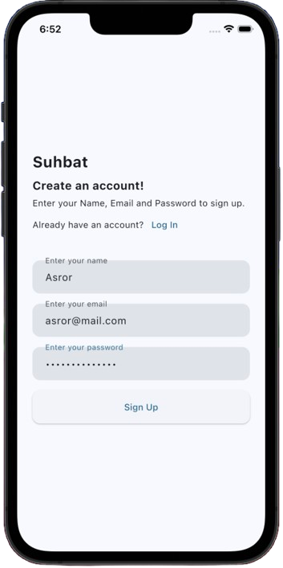
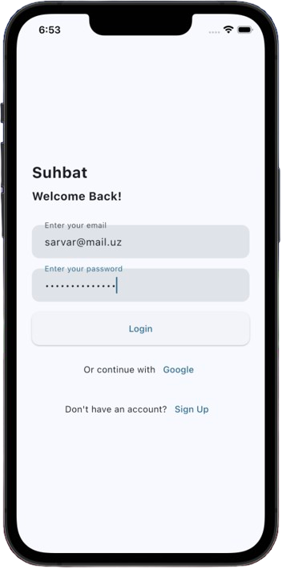
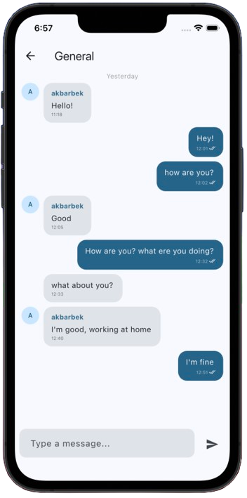
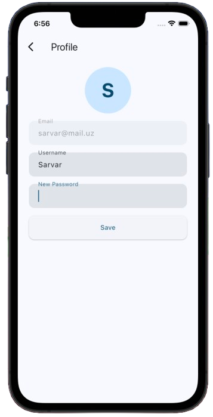
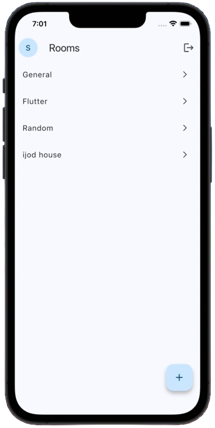

# Suhbat 💬

A real-time group chat application built with Flutter and Supabase, created as a portfolio project.

> 🚧 This project is currently under active development.

## Screenshots


<p float="left">
    
    
    
    
    
</p>


## Features

- 🔐 Email authentication with OTP verification
- 💬 Real-time group messaging
- 👥 Create and join chat rooms
- 👤 User profiles with avatar initials
- ✅ Read receipts
- 📅 Date separators between messages

## Tech Stack

| Technology | Usage |
|------------|-------|
| Flutter | UI framework |
| Supabase | Backend, Auth, Realtime DB |
| Riverpod | State management |
| go_router | Navigation |

## Getting Started

1. Clone the repo
```bash
git clone https://github.com/mukhammademineminov/suhbat.git
```

2. Install dependencies
```bash
flutter pub get
```

3. Create `.env` file in root:

SUPABASE_URL=your_supabase_url
SUPABASE_ANON_KEY=your_supabase_anon_key

4. Run the app
```bash
flutter run
```

## Author

**Mukhammademin** — Flutter Developer
[LinkedIn](https://www.linkedin.com/in/mukhammademin-eminov-00b977266?utm_source=share_via&utm_content=profile&utm_medium=member_ios) · [GitHub](https://github.com/mukhammademineminov)